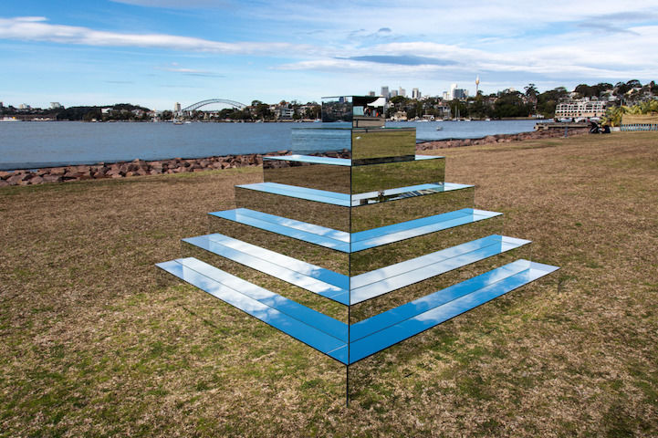

# nagłówek

1. **paragraf**
    + **paragraf?**
2. ~~paragraf~~
    1. ~~**paragraf**~~
3. *paragraf*

>***masło*** 
>>*ktoś kiedyś*.
<<<<<<< HEAD
`def fun()`
`print(HA!)`
`#laugh`

`def fun()
print(HA!)
#laugh`

tekst `def fun()
print(HA!)
#laugh` więcej tekstu
<<<<<<< HEAD

